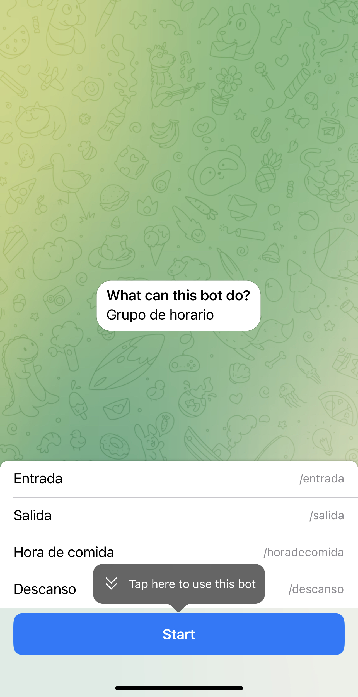
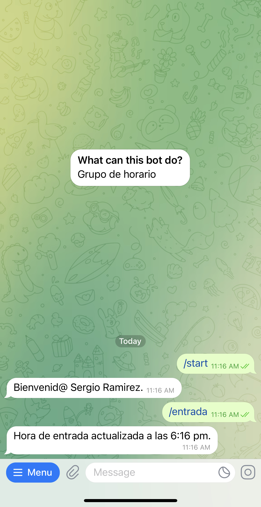
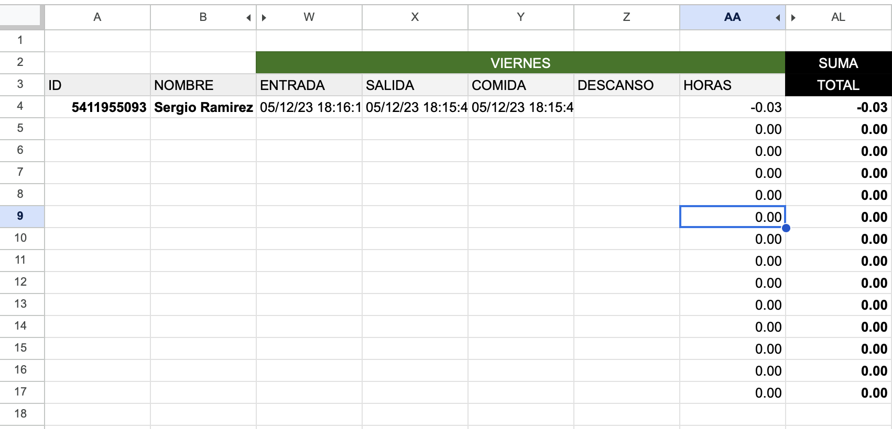

## Google Sheet Telegram Work Hours
This is a chat bot that take the status of the employee and save the time in a google spreedsheet.

  
  
  

## Installation

Run npm i to install de node modules.
[Follow the next steps to setup the project](https://developers.google.com/sheets/api/quickstart/nodejs).

The next spreedsheet shows the format that I use to create the week sheets
(https://docs.google.com/spreadsheets/d/14jYbePLgO0CIiu-2BzpIdSadfXSQSW7gaILq1V5AvCk/edit?usp=sharing)

You can use this spreedsheet id as your template in your .env (TEMPLATEID=14jYbePLgO0CIiu-2BzpIdSadfXSQSW7gaILq1V5AvCk)

Add de constant "WORKSHEETID" to your .env and set the spreedsheet id that you need to add the employeers dates.

Generate the telegram token from BotFather, is and easy way to create you chatbot (https://core.telegram.org/bots/features#botfather)

Add de constant "TELEGRAMTOKEN" to your .env with the telegram token